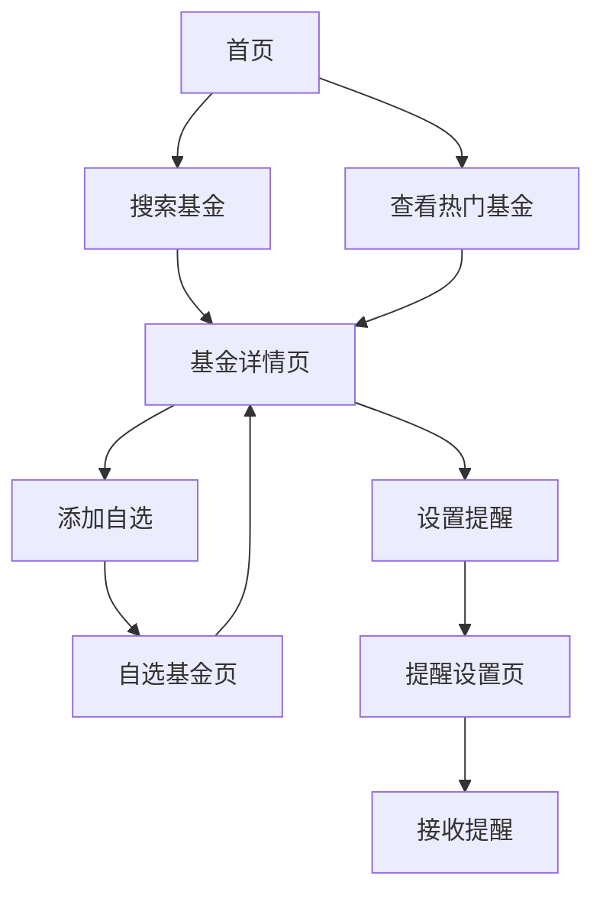

## 1. 产品概述
基金实时估值应用是一款专业的基金投资管理工具，为用户提供实时基金估值数据、历史走势分析和个性化投资管理功能。该应用帮助投资者及时掌握基金动态，做出更明智的投资决策。

目标用户群体包括基金投资者、理财顾问和金融从业者，通过提供准确、及时的基金估值信息，提升用户的投资管理效率。

## 2. 核心功能

### 2.1 用户角色
| 角色 | 注册方式 | 核心权限 |
|------|----------|----------|
| 普通用户 | 手机号/邮箱注册 | 查看基金估值、添加自选、设置提醒 |
| 高级用户 | 付费升级 | 高级图表分析、自定义提醒条件、数据导出 |

### 2.2 功能模块
基金实时估值应用包含以下主要页面：
1. **首页**: 热门基金展示、搜索功能、自选基金入口
2. **基金详情页**: 实时估值、历史走势、基本信息、对比分析
3. **自选基金页**: 自选基金管理、批量操作、自定义分组
4. **提醒设置页**: 估值变动提醒、条件设置、通知管理
5. **个人中心**: 用户信息、设置、帮助说明

### 2.3 页面详情
| 页面名称 | 模块名称 | 功能描述 |
|-----------|-------------|-------------|
| 首页 | 搜索模块 | 支持基金代码、名称搜索，智能联想推荐 |
| 首页 | 热门基金 | 展示市场热门基金，包含估值涨跌幅 |
| 首页 | 快速入口 | 自选基金、市场分类、提醒中心入口 |
| 基金详情页 | 实时估值区 | 显示当前估值、估值时间、涨跌幅、涨跌额 |
| 基金详情页 | 历史走势图表 | 支持日/周/月/年多周期切换，交互式图表 |
| 基金详情页 | 基本信息 | 基金名称、代码、类型、管理人、成立日期 |
| 基金详情页 | 对比分析 | 估值与实际净值对比，偏离度计算 |
| 自选基金页 | 基金列表 | 展示用户添加的自选基金，支持排序筛选 |
| 自选基金页 | 批量操作 | 批量删除、导出、分享功能 |
| 自选基金页 | 自定义分组 | 创建自定义分组，分类管理基金 |
| 提醒设置页 | 估值提醒 | 设置涨跌幅度提醒，支持百分比和绝对值 |
| 提醒设置页 | 提醒历史 | 查看历史提醒记录，支持标记已读 |
| 个人中心 | 用户信息 | 显示用户基本信息，支持编辑修改 |
| 个人中心 | 使用帮助 | 新用户引导，功能使用说明 |

## 3. 核心流程
用户操作流程：
1. 新用户注册登录 → 浏览首页热门基金 → 搜索关注基金 → 添加自选 → 设置提醒
2. 日常用户流程：查看自选基金 → 点击基金查看详情 → 分析历史走势 → 调整投资策略

## 4. 用户界面设计

### 4.1 设计风格
- **主色调**: 金融蓝 (#1E88E5) 搭配白色背景，营造专业可信的视觉感受
- **强调色**: 涨跌红绿配色，红色(#F44336)表示下跌，绿色(#4CAF50)表示上涨
- **按钮样式**: 圆角矩形设计，主要按钮使用主色调，次要按钮使用边框样式
- **字体选择**: 系统默认字体，数字部分使用等宽字体确保对齐
- **布局风格**: 卡片式布局，信息层级清晰，重要数据突出显示
- **图标风格**: 使用简洁的线性图标，保持界面清爽专业

### 4.2 页面设计概览
| 页面名称 | 模块名称 | UI元素 |
|-----------|-------------|-------------|
| 首页 | 搜索框 | 顶部固定搜索栏，圆角设计，支持语音输入 |
| 首页 | 基金卡片 | 白色卡片背景，显示基金名称、代码、估值、涨跌幅 |
| 基金详情页 | 估值展示 | 大字体显示当前估值，涨跌箭头图标，颜色区分涨跌 |
| 基金详情页 | 图表区域 | 深色图表背景，支持手势缩放，十字光标显示具体数值 |
| 自选基金页 | 列表项 | 简洁列表项，左滑显示删除按钮，支持拖拽排序 |
| 提醒设置页 | 条件设置 | 滑块设置涨跌幅度，开关控制提醒开关 |

### 4.3 响应式设计
采用桌面端优先设计策略：
- **桌面端**: 三栏布局，左侧导航，中间内容区，右侧辅助信息
- **平板端**: 两栏布局，顶部导航，下方内容区域
- **移动端**: 单栏布局，底部导航栏，重要功能常驻显示
- **触摸优化**: 增大点击区域，支持滑动手势，适配不同屏幕尺寸

### 4.4 数据展示规范
- **数值显示**: 基金净值保留4位小数，百分比保留2位小数
- **时间格式**: 实时估值显示"HH:MM"，历史数据按周期显示相应格式
- **加载状态**: 骨架屏占位，避免布局跳动，提供加载进度提示
- **空状态**: 友好的空状态提示，引导用户进行下一步操作