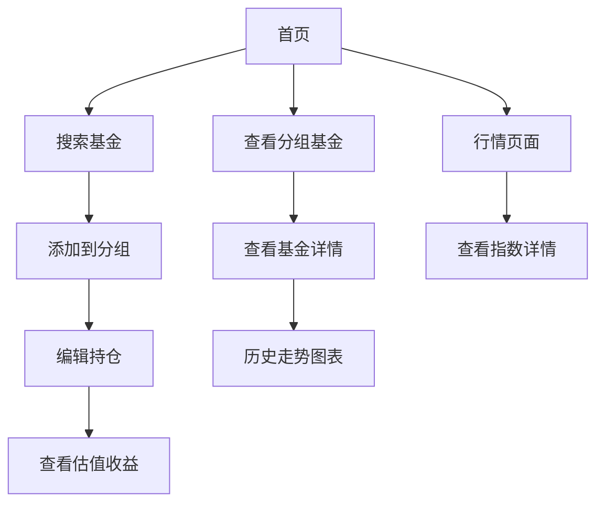

## 1. 产品概述

基金实时估值应用是一款纯前端的基金投资管理工具，为用户提供实时基金估值数据、市场指数行情和持仓管理功能。该应用帮助投资者及时掌握基金动态，做出更明智的投资决策。

**产品特点**：
- 纯前端应用，无需后端服务
- 数据存储在本地浏览器
- 支持多分组管理基金
- 实时估值和收益计算

## 2. 核心功能

### 2.1 功能模块

1. **估值首页**: 自选基金估值展示、收益汇总、分组管理
2. **行情页面**: 市场指数实时数据、分时图、K线图
3. **定投计算**: 定投收益计算器

### 2.2 页面详情

| 页面名称 | 模块名称 | 功能描述 |
|-----------|-------------|-------------|
| 估值首页 | 分组标签 | 支持多分组管理，可新建、编辑、删除分组 |
| 估值首页 | 汇总卡片 | 显示今日估算收益、涨跌数、持仓收益、持仓金额 |
| 估值首页 | 基金列表 | 展示分组内基金，包含估算涨幅、估算收益、昨日收益等 |
| 估值首页 | 基金搜索 | 搜索添加基金，支持代码和名称搜索 |
| 估值首页 | 持仓编辑 | 编辑基金份额和成本 |
| 行情页面 | 指数卡片 | 展示 A股、港股、美股主要指数 |
| 行情页面 | 分时图表 | 选中指数后展示分时走势 |
| 行情页面 | K线图表 | 支持日/周/月 K 线切换 |
| 定投页面 | 计算器 | 定投金额、周期、收益率计算 |

## 3. 核心流程

### 3.1 用户操作流程

### 3.2 数据流程

1. 打开应用 → 从 LocalStorage 读取持仓数据
2. 加载基金列表 → JSONP 获取实时估值
3. 计算收益 → 根据持仓份额和估值变化计算
4. 编辑持仓 → 保存到 LocalStorage

## 4. 用户界面设计

### 4.1 设计风格

- **主色调**: 科技蓝 (#3B82F6) 搭配白色背景
- **强调色**: 涨跌配色，红色(#EF4444)表示上涨，绿色(#22C55E)表示下跌
- **布局风格**: 卡片式布局，信息层级清晰
- **字体选择**: 系统默认字体，数字部分使用等宽字体

### 4.2 页面设计

| 页面名称 | 模块名称 | UI元素 |
|-----------|-------------|-------------|
| 首页 | 导航栏 | 顶部导航，包含估值、行情、定投入口 |
| 首页 | 分组标签 | 横向可滚动标签，支持拖拽排序 |
| 首页 | 汇总卡片 | 四宫格展示核心数据 |
| 首页 | 基金列表 | 表格形式，支持排序 |
| 行情页 | 指数卡片 | 网格布局，展示多个指数 |
| 行情页 | 图表区域 | 切换分时/K线，交互式图表 |

### 4.3 响应式设计

- **桌面端**: 宽屏布局，信息密度更高
- **移动端**: 单栏布局，优化触摸交互

## 5. 数据说明

### 5.1 数据来源

| 数据类型 | 来源 | 更新频率 |
|----------|------|----------|
| 基金估值 | 天天基金 | 交易日盘中实时 |
| 基金历史 | 东方财富 | 每日更新 |
| 市场指数 | 东方财富 | 实时 |
| K线数据 | 腾讯财经 | 每日更新 |

### 5.2 数据存储

用户数据（持仓、分组）存储在浏览器 LocalStorage：
- 无需注册登录
- 数据仅存在本地
- 清除浏览器数据会丢失

## 6. 技术架构

### 6.1 纯前端架构

- 所有数据通过 JSONP 直接从第三方接口获取
- 无需后端服务器
- 可部署为静态网站

### 6.2 技术栈

- React 18 + TypeScript
- TailwindCSS
- Zustand (状态管理)
- Recharts (图表)
- Vite (构建工具)
