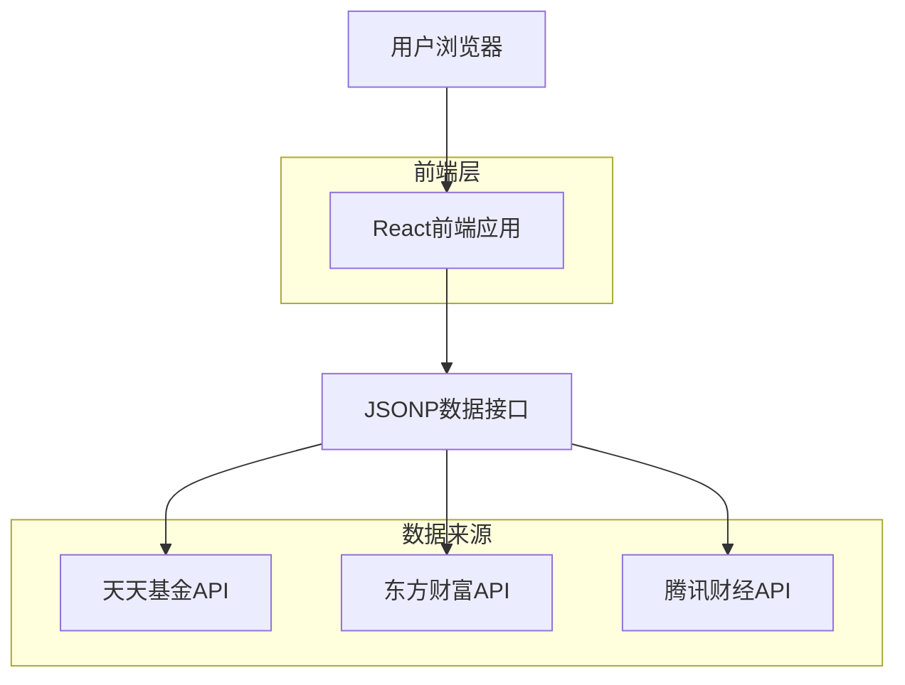

## 1. 架构设计



## 2. 技术描述

* **前端框架**: React@18 + TypeScript + TailwindCSS + Vite

* **状态管理**: Zustand

* **图表库**: Recharts

* **数据持久化**: LocalStorage

* **数据获取**: JSONP (跨域获取第三方数据)

* **部署**: 静态网站托管 (Vercel/Netlify/GitHub Pages)

## 3. 路由定义

| 路由          | 用途              |
| ----------- | --------------- |
| /           | 首页，展示自选基金估值和汇总  |
| /market     | 行情页，展示市场指数数据    |
| /dca        | 定投页，定投计算器功能     |

## 4. 数据接口

### 4.1 基金估值数据

**数据来源**: 天天基金 (JSONP)

```
https://fundgz.1234567.com.cn/js/{code}.js
```

返回格式:
```javascript
jsonpgz({
  "fundcode": "000001",
  "name": "华夏成长",
  "jzrq": "2024-01-15",   // 净值日期
  "dwjz": "1.2340",        // 单位净值
  "gsz": "1.2456",         // 估算值
  "gszzl": "0.94",         // 估算涨跌幅
  "gztime": "2024-01-16 15:00" // 估算时间
});
```

### 4.2 基金历史数据

**数据来源**: 东方财富 (JSONP)

```
https://api.fund.eastmoney.com/f10/lsjz?fundCode={code}&pageIndex=1&pageSize=20
```

### 4.3 基金搜索

**数据来源**: 东方财富 (JSONP)

```
https://fundsuggest.eastmoney.com/FundSearch/api/FundSearchAPI.ashx?m=1&key={keyword}
```

### 4.4 市场指数数据

**数据来源**: 东方财富 (JSONP)

```
https://push2.eastmoney.com/api/qt/ulist.np/get?secids={codes}&fields=f2,f3,f4,f5,f6,f12,f14,f15,f16,f17
```

### 4.5 指数分时数据

**数据来源**: 东方财富 (JSONP)

```
https://push2.eastmoney.com/api/qt/stock/trends2/get?secid={market}.{code}
```

### 4.6 指数K线数据

**数据来源**: 腾讯财经 (JSONP变量赋值)

```
https://web.ifzq.gtimg.cn/appstock/app/kline/kline?param={code},{period},,,{limit}
```

## 5. 数据模型

### 5.1 基金估值 (FundEstimate)

```typescript
interface FundEstimate {
  code: string;           // 基金代码
  name: string;           // 基金名称
  estimateNav: number;    // 估算净值
  lastNav: number;        // 最新净值
  prevNav: number;        // 前一日净值
  changePercent: number;  // 估算涨跌幅
  lastChangePercent: number; // 前一日涨跌幅
  lastNavDate: string;    // 净值日期
  estimateTime: string;   // 估算时间
  type: string;           // 基金类型
  navUpdatedToday: boolean; // 今日净值是否已更新
}
```

### 5.2 市场指数 (MarketIndex)

```typescript
interface MarketIndex {
  code: string;
  name: string;
  current: number;
  change: number;
  changePercent: number;
  open: number;
  high: number;
  low: number;
  volume: number;
  amount: number;
  updateTime: string;
  market: 'A' | 'HK' | 'US';
}
```

### 5.3 持仓数据 (Holding)

```typescript
interface Holding {
  code: string;
  shares: number;      // 持有份额
  cost: number;        // 持仓成本
  addedAt: string;     // 添加时间
}
```

## 6. 本地存储

### 6.1 存储键设计

```
fund-holdings -> 用户持仓数据
fund-groups -> 用户分组数据
```

### 6.2 数据结构

```typescript
// fund-holdings
{
  [groupId]: {
    [fundCode]: {
      shares: number,
      cost: number,
      addedAt: string
    }
  }
}

// fund-groups
{
  groups: Array<{
    id: string,
    name: string,
    order: number
  }>,
  activeGroupId: string
}
```

## 7. 性能优化

### 7.1 JSONP 请求优化

* 基金估值请求使用互斥锁，避免回调函数名冲突
* 历史数据请求支持并行，提高加载速度
* 请求超时处理，避免长时间等待

### 7.2 前端优化

* 组件懒加载，减少首屏加载时间
* 状态管理使用 Zustand，避免不必要的重渲染
* 图表使用 Recharts，轻量级且性能优秀

### 7.3 数据缓存

* 估值数据自动刷新（可配置间隔）
* 历史数据按需加载
* 本地存储持仓数据，无需后端

## 8. 部署说明

### 8.1 构建命令

```bash
npm run build
```

### 8.2 部署方式

纯静态网站，可部署到任何静态托管服务：

* **Vercel**: 自动检测 Vite 项目，一键部署
* **Netlify**: 设置构建命令 `npm run build`，发布目录 `dist`
* **GitHub Pages**: 使用 GitHub Actions 自动部署

### 8.3 无需后端

所有数据通过 JSONP 直接从第三方接口获取，无需维护后端服务器。
