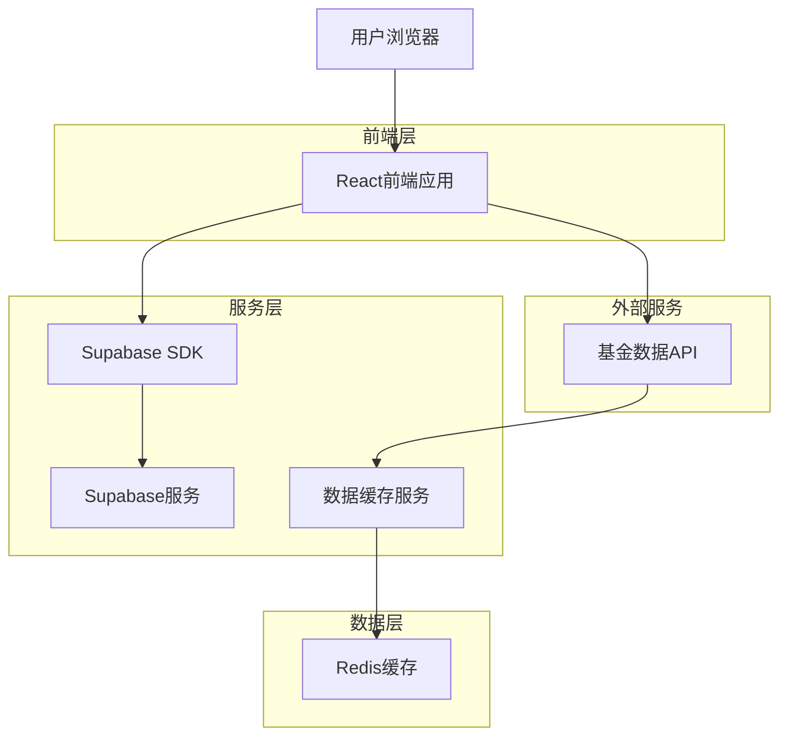
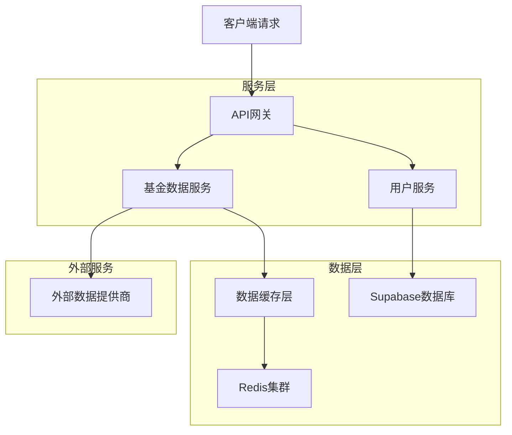
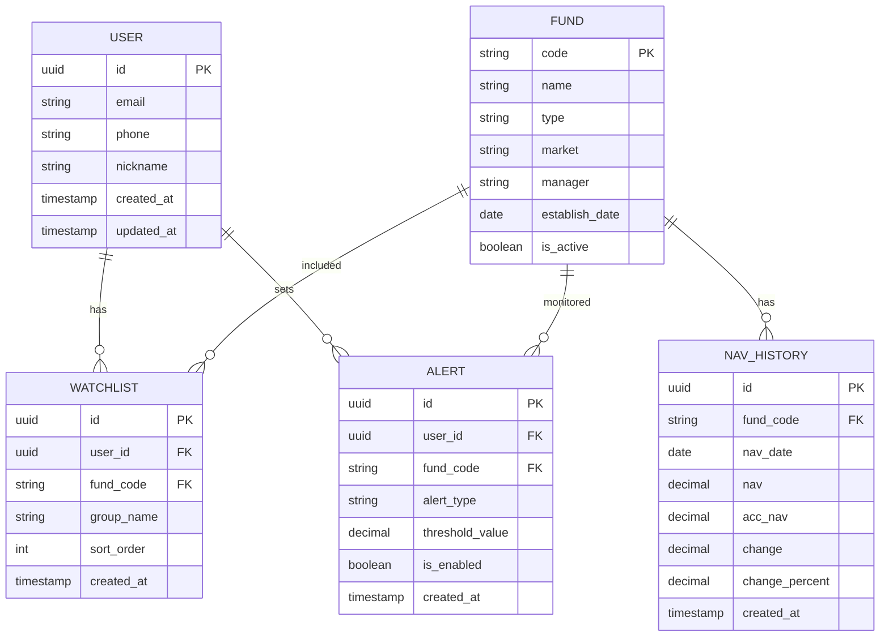

## 1. 架构设计



## 2. 技术描述

* **前端**: React\@18 + TypeScript + TailwindCSS + Vite

* **初始化工具**: vite-init

* **状态管理**: Zustand

* **图表库**: Apache ECharts

* **后端**: Supabase (BaaS)

* **数据库**: PostgreSQL (Supabase)

* **缓存**: Redis (Upstash)

* **部署**: Vercel

## 3. 路由定义

| 路由          | 用途              |
| ----------- | --------------- |
| /           | 首页，展示热门基金和搜索功能  |
| /fund/:code | 基金详情页，显示详细信息和图表 |
| /watchlist  | 自选基金页面，管理关注的基金  |
| /alerts     | 提醒设置页面，配置估值提醒   |
| /profile    | 个人中心，用户信息和设置    |
| /login      | 登录页面            |
| /register   | 注册页面            |
| /help       | 使用帮助页面          |

## 4. API定义

### 4.1 基金数据API

```
GET /api/funds/realtime?codes=000001,000002
```

请求参数:

| 参数名   | 参数类型   | 是否必需 | 描述           |
| ----- | ------ | ---- | ------------ |
| codes | string | 是    | 基金代码，多个用逗号分隔 |

响应:

| 参数名           | 参数类型   | 描述     |
| ------------- | ------ | ------ |
| code          | string | 基金代码   |
| name          | string | 基金名称   |
| nav           | number | 当前估值   |
| change        | number | 涨跌额    |
| changePercent | number | 涨跌幅百分比 |
| updateTime    | string | 更新时间   |

示例:

```json
{
  "data": [
    {
      "code": "000001",
      "name": "华夏成长",
      "nav": 1.2345,
      "change": 0.0123,
      "changePercent": 1.01,
      "updateTime": "2024-01-15 14:30:00"
    }
  ]
}
```

### 4.2 历史数据API

```
GET /api/funds/history/:code?period=daily&start=2024-01-01&end=2024-01-15
```

请求参数:

| 参数名    | 参数类型   | 是否必需 | 描述                             |
| ------ | ------ | ---- | ------------------------------ |
| period | string | 是    | 周期：daily/weekly/monthly/yearly |
| start  | string | 否    | 开始日期                           |
| end    | string | 否    | 结束日期                           |

## 5. 服务器架构



## 6. 数据模型

### 6.1 数据模型定义



### 6.2 数据定义语言

用户表 (users)

```sql
-- 创建表
CREATE TABLE users (
  id UUID PRIMARY KEY DEFAULT gen_random_uuid(),
  email VARCHAR(255) UNIQUE,
  phone VARCHAR(20) UNIQUE,
  nickname VARCHAR(100),
  avatar_url TEXT,
  created_at TIMESTAMP WITH TIME ZONE DEFAULT NOW(),
  updated_at TIMESTAMP WITH TIME ZONE DEFAULT NOW()
);

-- 创建索引
CREATE INDEX idx_users_email ON users(email);
CREATE INDEX idx_users_phone ON users(phone);
```

基金表 (funds)

```sql
-- 创建表
CREATE TABLE funds (
  code VARCHAR(10) PRIMARY KEY,
  name VARCHAR(200) NOT NULL,
  type VARCHAR(50) NOT NULL,
  market VARCHAR(20) NOT NULL,
  manager VARCHAR(200),
  establish_date DATE,
  is_active BOOLEAN DEFAULT true,
  created_at TIMESTAMP WITH TIME ZONE DEFAULT NOW(),
  updated_at TIMESTAMP WITH TIME ZONE DEFAULT NOW()
);

-- 创建索引
CREATE INDEX idx_funds_type ON funds(type);
CREATE INDEX idx_funds_market ON funds(market);
CREATE INDEX idx_funds_active ON funds(is_active);
```

自选基金表 (watchlists)

```sql
-- 创建表
CREATE TABLE watchlists (
  id UUID PRIMARY KEY DEFAULT gen_random_uuid(),
  user_id UUID REFERENCES users(id) ON DELETE CASCADE,
  fund_code VARCHAR(10) REFERENCES funds(code) ON DELETE CASCADE,
  group_name VARCHAR(100) DEFAULT '默认分组',
  sort_order INTEGER DEFAULT 0,
  created_at TIMESTAMP WITH TIME ZONE DEFAULT NOW(),
  UNIQUE(user_id, fund_code)
);

-- 创建索引
CREATE INDEX idx_watchlists_user_id ON watchlists(user_id);
CREATE INDEX idx_watchlists_fund_code ON watchlists(fund_code);
CREATE INDEX idx_watchlists_group ON watchlists(group_name);
```

估值提醒表 (alerts)

```sql
-- 创建表
CREATE TABLE alerts (
  id UUID PRIMARY KEY DEFAULT gen_random_uuid(),
  user_id UUID REFERENCES users(id) ON DELETE CASCADE,
  fund_code VARCHAR(10) REFERENCES funds(code) ON DELETE CASCADE,
  alert_type VARCHAR(20) NOT NULL CHECK (alert_type IN ('increase', 'decrease', 'absolute')),
  threshold_value DECIMAL(10,4) NOT NULL,
  is_enabled BOOLEAN DEFAULT true,
  last_triggered TIMESTAMP WITH TIME ZONE,
  created_at TIMESTAMP WITH TIME ZONE DEFAULT NOW(),
  updated_at TIMESTAMP WITH TIME ZONE DEFAULT NOW()
);

-- 创建索引
CREATE INDEX idx_alerts_user_id ON alerts(user_id);
CREATE INDEX idx_alerts_fund_code ON alerts(fund_code);
CREATE INDEX idx_alerts_enabled ON alerts(is_enabled);
```

净值历史表 (nav\_history)

```sql
-- 创建表
CREATE TABLE nav_history (
  id UUID PRIMARY KEY DEFAULT gen_random_uuid(),
  fund_code VARCHAR(10) REFERENCES funds(code) ON DELETE CASCADE,
  nav_date DATE NOT NULL,
  nav DECIMAL(10,4) NOT NULL,
  acc_nav DECIMAL(10,4),
  change DECIMAL(10,4),
  change_percent DECIMAL(8,4),
  created_at TIMESTAMP WITH TIME ZONE DEFAULT NOW(),
  UNIQUE(fund_code, nav_date)
);

-- 创建索引
CREATE INDEX idx_nav_history_fund_code ON nav_history(fund_code);
CREATE INDEX idx_nav_history_date ON nav_history(nav_date);
CREATE INDEX idx_nav_history_created ON nav_history(created_at DESC);
```

### 6.3 访问权限设置

```sql
-- 基本访问权限
GRANT SELECT ON funds TO anon;
GRANT SELECT ON nav_history TO anon;

-- 认证用户权限
GRANT ALL PRIVILEGES ON watchlists TO authenticated;
GRANT ALL PRIVILEGES ON alerts TO authenticated;
GRANT SELECT ON users TO authenticated;

-- RLS策略
ALTER TABLE watchlists ENABLE ROW LEVEL SECURITY;
ALTER TABLE alerts ENABLE ROW LEVEL SECURITY;

-- 用户只能查看和管理自己的数据
CREATE POLICY "用户只能查看自己的自选" ON watchlists
  FOR ALL USING (auth.uid() = user_id);

CREATE POLICY "用户只能管理自己的提醒" ON alerts
  FOR ALL USING (auth.uid() = user_id);
```

## 7. 缓存策略

### 7.1 缓存层级

* **浏览器缓存**: 静态资源缓存1小时

* **CDN缓存**: 基金基础信息缓存30分钟

* **Redis缓存**: 实时估值数据缓存15分钟

* **数据库缓存**: 历史数据缓存1小时

### 7.2 缓存键设计

```
fund:realtime:{code} -> 实时估值数据
fund:history:{code}:{period} -> 历史数据
user:watchlist:{user_id} -> 用户自选列表
user:alerts:{user_id} -> 用户提醒设置
```

## 8. 性能优化

### 8.1 前端优化

* 组件懒加载，减少首屏加载时间

* 虚拟滚动处理长列表

* 图片懒加载和压缩

* 使用Service Worker缓存静态资源

### 8.2 后端优化

* 数据库索引优化查询性能

* 分页查询避免大数据量传输

* 异步处理非关键任务

* 连接池管理数据库连接

### 8.3 监控指标

* API响应时间 < 200ms

* 页面加载时间 < 3s

* 数据更新延迟 < 15分钟

* 系统可用性 > 99.9%

